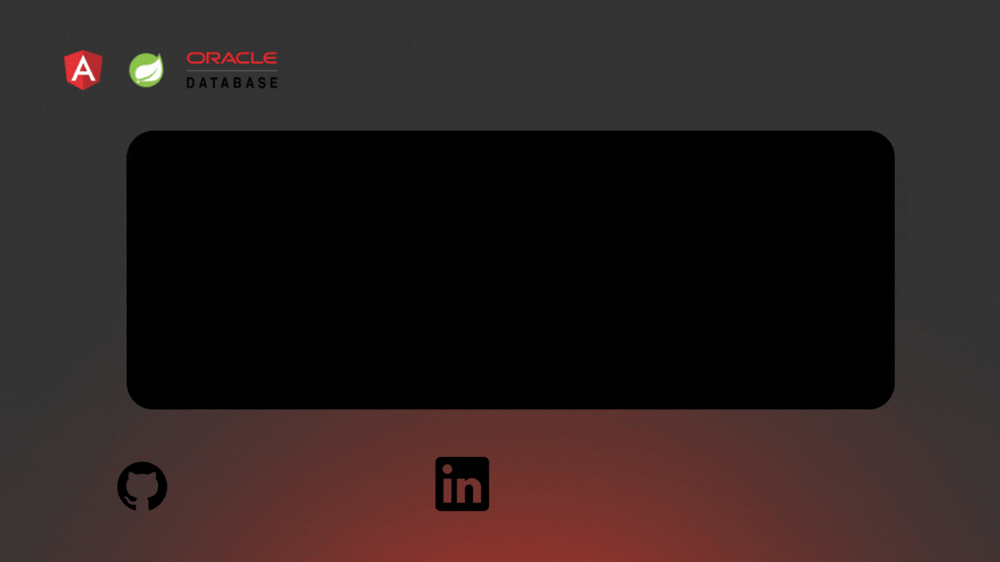

 #
 #   Hey! Nice to see you.

 ### Welcome to mi GitHub page!
 

  #   

 ### About Me 
 I'm a Software Developer passionate about technology, specialized in the Java ecosystem with practical experience in the Spring framework, Angular for frontend development, and Oracle databases. My main focus lies in creating innovative and efficient solutions that drive project success. I constantly seek to learn and improve my technical skills to tackle new challenges and make meaningful contributions to collaborative development teams.

 #  

#
 ### Social

#
#      

### Skills
#

#          

### Statics 

#
 
 

<!--
**BaskaDev/BaskaDev** is a ✨ _special_ ✨ repository because its `README.md` (this file) appears on your GitHub profile.

Here are some ideas to get you started:

- 🔭 I’m currently working on ...
- 🌱 I’m currently learning ...
- 👯 I’m looking to collaborate on ...
- 🤔 I’m looking for help with ...
- 💬 Ask me about ...
- 📫 How to reach me: ...
- 😄 Pronouns: ...
- ⚡ Fun fact: ...
-->
